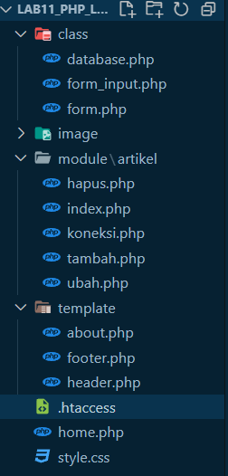

## Praktikum-11
### Nama : Herlan Wibowo
### NIM : 312210324
### Kelas : TI 22 A3
### PHP OOP Lanjutan
Praktikum 11: OOP Lanjutan

• Copy file library (class) dari praktikum 10 dan letakkan pada folder
class. 
• Buat file template yang berisi template dan css untuk header, footer
dan menu sidebar. 
• Buat modul artikel yang berisi CRUD dengan memanfaatkan library
database dan form tersbut. 
• File index.php berisi proses routing aplikasi dan dikombinasikan
dengan penggunaan mod_rewrite pada file .htaccess

### Hasil

Praktikum 11: OOP Lanjutan

• Lengkapi code programnya dan sesuaikan konfigurasi yang
diperlukan.

### Output
- Halaman Home

- Halaman Tentang

- Halaman Daftar Barang

